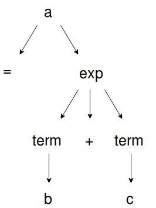

Trabalho da disciplina Compiladores sob orientação da Profª Drª Thatyana de Faria Piola Seraphim, no curso de Engenharia da Computação - Universidade Federal de Itajubá.

Objetivo: criar, desenvolver e implementar um analisador léxico e um analisador sintático.
Suporte à comandos de:
    -Atribuição
    -Entrada e saída
    -Condicionais
    -Repetição
Suporte à operadores relacionais, lógicos e aritméticos.
Implementação Bison/Yacc + FLEX.

--Manual--

Um 'identificador' é uma variável que pode ser um caracter de 'a' à 'z' ou de 'A' à 'Z' ( [a-zA-Z] ).
Um 'termo' é um valor que pode ser um identificador ou um número.
Uma 'expressão' é um valor que pode ser representado por números ou expressões algébricas, e podem conter identificadores ( [0-9]+ | exp ). 
Uma 'condição' é uma expressão envolvendo um identificador, um operador relacional e uma expressão (identificador operador_relacional expressão).

Comando de atribuição:

    identificador = expressão;

Comando de condicional (if-then):

    se condição entao identificador = expressão;
    
Comando de repetição 'enquanto-faça'(while):
    
    enquanto identificador operador_relacional expressão faca identificador = identificador operador termo;

    
--Programas exemplos--

1)

    a = 2; 
    b = 5; 
    enquanto b < 50 faca b = b * a; 
    imprima b;
    
2)

    a = 1; 
    b = 2; 
    c = 4; 
    se a == c-b/2 entao a = 10; 
    imprima a; 
    
3)

    a = 2; 
    b = 3; 
    c = b/a; /
    enquanto c < b*a faca c = c * a; 
    imprima c; 

    
--Instruções para usar--

Enquanto no diretório do projeto, execute os seguintes comandos:

- yacc -d statements.y
- flex tokens.l
- gcc y.tab.c lex.yy.c -o programa

Depois desse procedimento, execute o programa.

--Expresões dos tokens--

| Token        | Retorno           |
| ------------- |:-------------:|
| imprima      | print |
| sair      | exit_command      |
| se | tokenIf      |
| entao | tokenThen      |
| senao | tokenElse      |
| enquanto | tokenWhile      |
| faca | tokenDo      |
| >= | tokenIf      |
| <= | tokenIf      |
| > | tokenGE      |
| < | tokenLE      |
| == | tokenEQ      |
| != | tokenNE      |
| || | tokenOR      |
| && | tokenAND      |
| [a-zA-Z] | yylval.id = yytext[0] e identifier      |
| [a-zA-Z]+ | yylval.str = yytext e word      |
| 0-9]+  | yylval.num = atoi(yytext) e number     |
| [ \t\n]  | ;     |
| [-+=;*/^%]  | yytext[0]     |
| .  | ECHO e yyerror ("token nao reconhecido")     |

Árvore de derivação para a cadeia a = b + c

--FALTA--

2. Os autômatos finitos determinı́sticos (AFDs) obtidos a partir das expressões regulares. Caso tenha obtido
um autômato finito não determinı́stico (AFN), este deverá ser apresentado, assim como o AFN-estendido
correspondente, obtido a partir do emprego do método de Thompson.

4. Método de análise sintática utilizado. Inclua neste item, todas as transformações que foram realizadas,
de acordo com o método utilizado.
